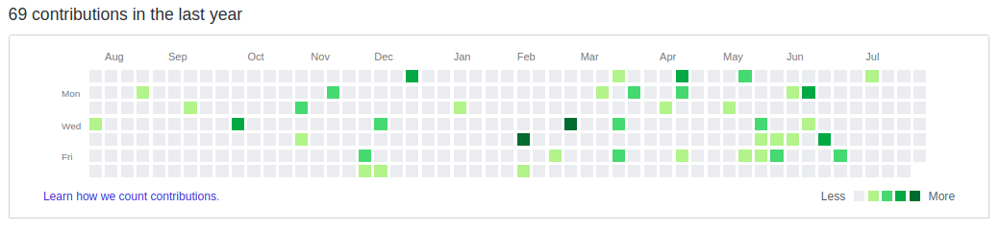
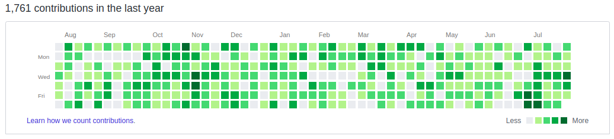

GitHub Activity Generator [](https://gitter.im/github-activity-generator/community?utm_source=badge&utm_medium=badge&utm_campaign=pr-badge) [](https://github.com/Shpota/github-activity-generator/actions?query=workflow%3Abuild)
=========================

A script that helps you *instantly* generate a beautiful GitHub Contributions Graph
for the last year.

## ⚠ Disclaimer

This script is for educational purposes and demonstrating GitHub mechanics. It should not be used to misrepresent professional contributions or coding activity.

## Check my other projects

I created this project more than five years ago. Since then, I have built several **much more valuable
tools** which I encourage you to check:

- [sol4k](https://github.com/sol4k/sol4k) - Kotlin, JVM, and Android client for Solana
- [podil.js](https://github.com/podiljs/podil) - Lightweight and secure database schema migration tool
- [goxygen](https://github.com/Shpota/goxygen) - Web project generator
- [zeit](https://github.com/Shpota/zeit) - A Fitbit clock face for learners of the German language


## What it looks like

### Before :neutral_face: :no_mouth: :unamused: 

### After :muscle: :relieved: :heart: :sunglasses: :metal: :horse: :wink: :fire: :dancer: :santa: :fireworks: :cherries: :tada:


## How to use
1. Create an empty GitHub repository. Do not initialize it.
2. Download [the contribute.py script](https://github.com/Shpota/github-activity-generator/archive/master.zip) 
and execute it passing the link on the created repository
```sh
python contribute.py --repository=git@github.com:user/repo.git
```
Now you have a repository with lots of changes in your GitHub account.
Note: it takes several minutes for GitHub to reindex your activity.

## How it works
The script initializes an empty git repository, creates a text file and starts 
generating changes to the file for every day within the last year (0-20 commits 
per day). Once the commits are generated it links the created repository with
the remote repository and pushes the changes.

## Customizations
You can customize how often to commit and how many commits a day to make, etc.

For instance, with the following command, the script will make from 1 to 12 
commits a day. It will commit 60% days a year.
```sh
python contribute.py --max_commits=12 --frequency=60 --repository=git@github.com:user/repo.git
```
Use `--no_weekends` option if you don't want to commit on weekends
```sh
python contribute.py --no_weekends
```
If you do not set the `--repository` argument the script won't push the changes. 
This way you can import the generated repository yourself.

Use `--days_before` and `--days_after` to specify how many days before the current
date the script should start committing, and how many days after the current date it
will keep committing.

```sh
python contribute.py --days_before=10 --days_after=15
```

Run `python contribute.py --help` to get help.

## System requirements
To be able to execute the script you need to have Python and Git installed.

## Troubleshooting

#### I performed the script but my GitHub activity is still the same.
It might take several minutes for GitHub to reindex your activity. Check
if the repository has new commits and wait a couple of minutes.
#### The changes are still not reflected after some time.
Are you using a private repository? If so, enable showing private contributions
[following this guide](https://help.github.com/en/articles/publicizing-or-hiding-your-private-contributions-on-your-profile).

#### Still no luck
Make sure the email address you have in GitHub is the same as you have in
your local settings. GitHub counts contributions only when they are made 
using the corresponding email.

Check your local email settings with:
```
git config --get user.email
```
If it doesn't match with the one from GitHub reset it with
```
git config --global user.email "user@example.com"
```
Create a new repository and rerun the script.

#### There are errors in the logs of the script.
Maybe you tried to use an existing repository. If so, make sure you are using
a new one which is *not initialized*.

**If none of the options helped, open an issue and I will fix it as soon as possible.**
